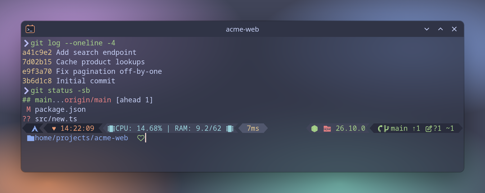
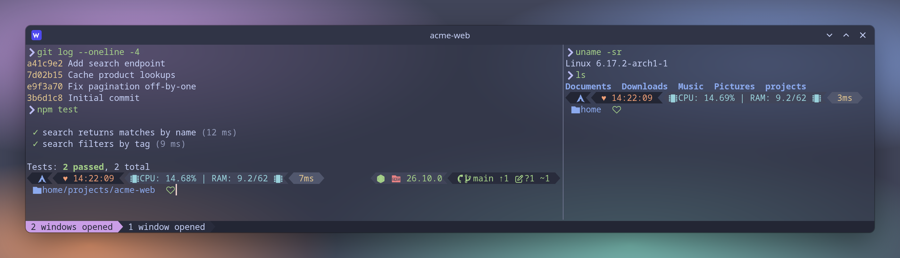
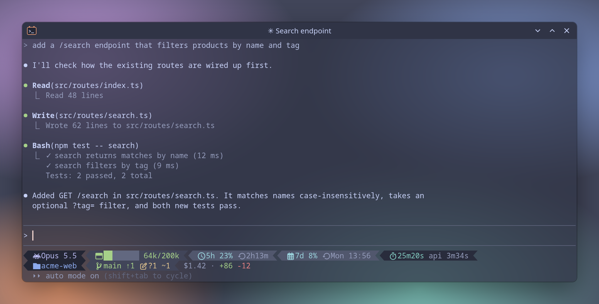

# dotfiles

My terminal setup: [kitty](https://sw.kovidgoyal.net/kitty/) + zsh with [oh-my-zsh](https://ohmyz.sh/), in the [Catppuccin Frappé](https://catppuccin.com/) palette. The prompt is a native oh-my-zsh theme that rebuilds Oh My Posh's `wholespace` theme. A [WezTerm](https://wezterm.org/) config with the same look and shortcuts as kitty is included for Linux and Windows, along with an [Oh My Posh](https://ohmyposh.dev/) version of the prompt, so every machine shows the same prompt. There's also a [Claude Code](https://code.claude.com/) statusline in the same style.



## What's inside

| Path | What it is | Installed to |
| --- | --- | --- |
| `kitty/kitty.conf` | kitty config: Catppuccin Frappé colors, Noto Sans Mono 10pt, 75% opacity with blur, powerline tab bar, custom shortcuts | `~/.config/kitty/kitty.conf` |
| `zsh/.zshrc` | oh-my-zsh setup with plugins | `~/.zshrc` |
| `zsh/themes/wholespace-frappe.zsh-theme` | The prompt theme | `~/.oh-my-zsh/custom/themes/` |
| `wezterm/wezterm.lua` | WezTerm config matching kitty: same colors, font, opacity, tab bar and shortcuts. See [wezterm/README.md](wezterm/README.md) | `~/.config/wezterm/wezterm.lua` (Windows: `%USERPROFILE%\.config\wezterm\wezterm.lua`) |
| `oh-my-posh/wholespace-frappe.omp.json` | The same prompt as an Oh My Posh config, for PowerShell, zsh or bash | `~/.config/oh-my-posh/` (Windows: `%USERPROFILE%\.config\oh-my-posh\`) |
| `claude/claude-statusline.omp.json` | Claude Code statusline (Oh My Posh). See [claude/README.md](claude/README.md) | `~/.claude/` |
| `claude/subagent-statusline.py` | Rows for Claude Code's agent panel | `~/.claude/` |
| `windows/Microsoft.PowerShell_profile.ps1` | PowerShell profile that loads the prompt | `$PROFILE` |
| `packages/arch.txt` | Arch packages the setup needs | - |
| `install.sh` | Installs everything on Linux | - |

## The prompt

The screenshot above shows it in kitty. Laid out in text (icons omitted):

```
[os] ♥ 00:56:29 | CPU: 3.87% | RAM: 18.4/62 | 7ms                [node] [github] [branch] main ≡
[folder] home/Documents/Repos/TuffLevels [status]
```

**Line 1, left:** OS logo (read from `/etc/os-release`), clock, CPU use since the last prompt, RAM used/total in GiB, and how long the last command took.

**Line 1, right:** Node.js version (only in Node projects, with an npm or yarn icon) and git:

| Git symbol | Meaning |
| --- | --- |
| `≡` | In sync with upstream |
| `↑1 ↓2` | Commits ahead / behind upstream |
| `≢` | No upstream branch |
| pencil `?1 ~2` | Working tree: untracked (`?`), added (`+`), modified (`~`), deleted (`-`) |
| checkbox `+1` | Staged changes, same symbols |
| stack `1` | Stash entries |

The host icon shows GitHub, GitLab, Bitbucket or Azure DevOps based on the remote URL.

**Line 2:** the path (`~` is shown as `home`) and a status icon that turns red when the last command failed.

After you press Enter, the prompt collapses to a single arrow to keep scrollback clean. The tab title shows the current folder name.

The theme was checked against Oh My Posh 31.4.0 running the same config. Their output matched glyph for glyph and color for color across git states, timer lengths and path types. The CPU figure is deliberately different: it shows real use since the previous prompt.

## Dependencies

| Need | Arch package | Notes |
| --- | --- | --- |
| zsh 5.3+ | `zsh` | |
| git 2.35+ | `git` | `--show-stash` needs 2.35 |
| curl | `curl` | used to install oh-my-zsh |
| kitty | `kitty` | any truecolor terminal works for the prompt |
| Noto Sans Mono | `noto-fonts` | terminal font |
| Nerd Font symbols | `ttf-nerd-fonts-symbols-mono` | prompt icons; kitty uses it as a fallback font |
| oh-my-zsh | - | installed by `install.sh` |
| [zsh-autosuggestions](https://github.com/zsh-users/zsh-autosuggestions) | - | cloned by `install.sh` |
| [fast-syntax-highlighting](https://github.com/zdharma-continuum/fast-syntax-highlighting) | - | cloned by `install.sh` |

The theme reads `/proc/stat` and `/proc/meminfo`, so it's Linux-only. It needs a UTF-8 locale and switches to `C.UTF-8` on its own if the current locale isn't UTF-8.

## Install (Linux)

```bash
git clone https://github.com/carldibert/dotfiles.git ~/dotfiles
cd ~/dotfiles
./install.sh --dry-run   # see what it will do
./install.sh
exec zsh
```

`install.sh`:

1. Installs `packages/arch.txt` with `sudo pacman -S --needed`. Skip this with `--no-packages`, for example on a non-Arch server.
2. Installs oh-my-zsh if `~/.oh-my-zsh` doesn't exist.
3. Clones the two zsh plugins.
4. Symlinks the configs into place. Any existing file is moved to `<file>.bak-<date>` first. `wezterm.lua` and the Oh My Posh config are only linked if `wezterm` / `oh-my-posh` are installed, and the Claude Code statusline only if both `oh-my-posh` and `~/.claude` exist. It doesn't touch `~/.claude/settings.json`: see [claude/README.md](claude/README.md#install) for the lines to add.

Running it again is safe: anything already linked is left alone.

## Install (Windows 11)

```powershell
winget install Microsoft.PowerShell wez.wezterm
winget install JanDeDobbeleer.OhMyPosh -s winget
```

1. Install [Noto Sans Mono](https://fonts.google.com/noto/specimen/Noto+Sans+Mono): unzip it, select the `static\NotoSansMono-*.ttf` files, then right-click and choose **Install**. WezTerm already includes the Nerd Font icons.
2. Copy the configs into place (run from the cloned repo):

   ```powershell
   New-Item -ItemType Directory -Force "$HOME\.config\wezterm", "$HOME\.config\oh-my-posh" | Out-Null
   Copy-Item wezterm\wezterm.lua "$HOME\.config\wezterm\"
   Copy-Item oh-my-posh\wholespace-frappe.omp.json "$HOME\.config\oh-my-posh\"
   ```

3. Set up the prompt as described in [Oh My Posh in PowerShell](#windows-powershell).

The same `wezterm.lua` is used on both systems. On Windows it starts PowerShell 7 (`pwsh.exe`) and uses the Acrylic backdrop for the blur. See [wezterm/README.md](wezterm/README.md#install-windows-11) for details.

## WezTerm

`wezterm/wezterm.lua` copies kitty's colors, font, opacity, tab bar and shortcuts, on Linux and Windows. Setup, shortcuts and screenshots are in [wezterm/README.md](wezterm/README.md).



## Claude Code statusline

`claude/` has a two-line Claude Code statusline drawn by Oh My Posh in the prompt's style: model, context used out of 200k (with checkpoint warnings), usage limits, session time, repo, git, worktree and cost, plus matching rows for the agent panel. Setup is in [claude/README.md](claude/README.md).



## Oh My Posh

`oh-my-posh/wholespace-frappe.omp.json` draws the same prompt as the zsh theme. It works in any terminal and on any OS. Its icons need a Nerd Font: WezTerm has one built in, and kitty falls back to `ttf-nerd-fonts-symbols-mono`.

### Windows (PowerShell)

1. Install it with `winget install JanDeDobbeleer.OhMyPosh -s winget` (see [Install (Windows 11)](#install-windows-11)), and copy the config to `%USERPROFILE%\.config\oh-my-posh\`.
2. Open your profile with `notepad $PROFILE` (create it with `New-Item -Force $PROFILE` if it doesn't exist) and add the lines from `windows/Microsoft.PowerShell_profile.ps1`:

   ```powershell
   oh-my-posh init pwsh --config "$HOME\.config\oh-my-posh\wholespace-frappe.omp.json" | Invoke-Expression
   ```

3. If the profile is blocked from running, use `Set-ExecutionPolicy -Scope CurrentUser RemoteSigned`.
4. Open a new WezTerm window.

### Linux (zsh or bash)

On zsh you don't need Oh My Posh: the native theme draws the same prompt and starts faster. Use it on machines where you'd rather share one config file with Windows, or with bash.

1. Install it. On Arch: `paru -S oh-my-posh-bin` (AUR). Anywhere else:

   ```bash
   curl -s https://ohmyposh.dev/install.sh | bash -s -- -d ~/.local/bin
   ```

2. Link the config with `./install.sh` (it links it once `oh-my-posh` is on your `PATH`), or by hand:

   ```bash
   mkdir -p ~/.config/oh-my-posh
   ln -s ~/dotfiles/oh-my-posh/wholespace-frappe.omp.json ~/.config/oh-my-posh/
   ```

3. Load it from your shell config.

   **zsh**: in `~/.zshrc`, turn off the oh-my-zsh theme so the two prompts don't fight, then start Oh My Posh after oh-my-zsh is sourced:

   ```zsh
   ZSH_THEME=""
   # ...
   source $ZSH/oh-my-zsh.sh
   eval "$(oh-my-posh init zsh --config ~/.config/oh-my-posh/wholespace-frappe.omp.json)"
   ```

   **bash**: add to the end of `~/.bashrc`:

   ```bash
   eval "$(oh-my-posh init bash --config ~/.config/oh-my-posh/wholespace-frappe.omp.json)"
   ```

4. Run `exec zsh` (or `exec bash`).

Note that `~/.zshrc` is a symlink into this repo once `install.sh` has run, so editing it changes the repo copy. To switch back, restore `ZSH_THEME="wholespace-frappe"` and remove the `eval` line.

## kitty shortcuts

`kitty.conf` clears kitty's default shortcuts and defines its own:

| Keys | Action |
| --- | --- |
| `Ctrl+Shift+C` / `Ctrl+Shift+V` | Copy / paste |
| `Alt+Enter` / `Alt+W` | New / close window (split) |
| `Ctrl+Tab` / `Alt+Tab` | Next / previous window |
| `Alt+R` | Resize the current window |
| `Alt+L` | Next layout |
| `Alt+T` / `Alt+Q` | New / close tab |
| `Alt+Right` / `Alt+Left` | Next / previous tab |
| `Alt+↑` / `Alt+↓` | Move tab forward / backward |
| `Alt+N` | Rename tab |
| `Alt+Numpad+` / `Alt+Numpad−` / `Alt+Backspace` | Font bigger / smaller / reset |
| `Alt+F5` | Reload kitty.conf |

Selecting text copies it, and middle-click pastes the selection.

## Customizing

- **Colors:** edit the `_ws_c` table at the top of the theme. For Oh My Posh, edit the `palette` block in the `.omp.json`. For WezTerm, edit the `c` table and `config.colors` in `wezterm.lua`. Both use the Catppuccin Frappé names (`crust`, `surface0`, `blue`, …).
- **Icons:** the `_ws_g` table maps names to Nerd Font code points (`"${(#):-0xE0B2}"`). Look up others at [nerdfonts.com/cheat-sheet](https://www.nerdfonts.com/cheat-sheet).
- **Segments:** each segment is one `_ws_*` function. To drop one, delete its `left+=` line in `_ws_precmd`.

## Credits

- [`wholespace`](https://ohmyposh.dev/docs/themes) theme from the Oh My Posh theme gallery, which this prompt recreates
- [Catppuccin](https://github.com/catppuccin/catppuccin) Frappé palette
- [oh-my-zsh](https://github.com/ohmyzsh/ohmyzsh), [zsh-autosuggestions](https://github.com/zsh-users/zsh-autosuggestions), [fast-syntax-highlighting](https://github.com/zdharma-continuum/fast-syntax-highlighting)
- [Nerd Fonts](https://www.nerdfonts.com/) for the icons

## License

[MIT](LICENSE)
