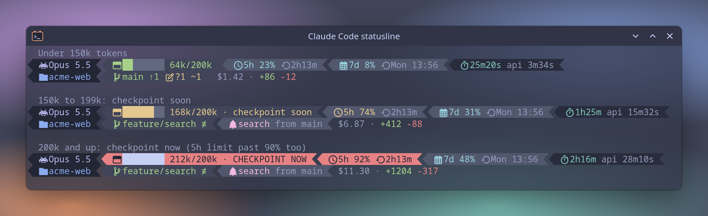
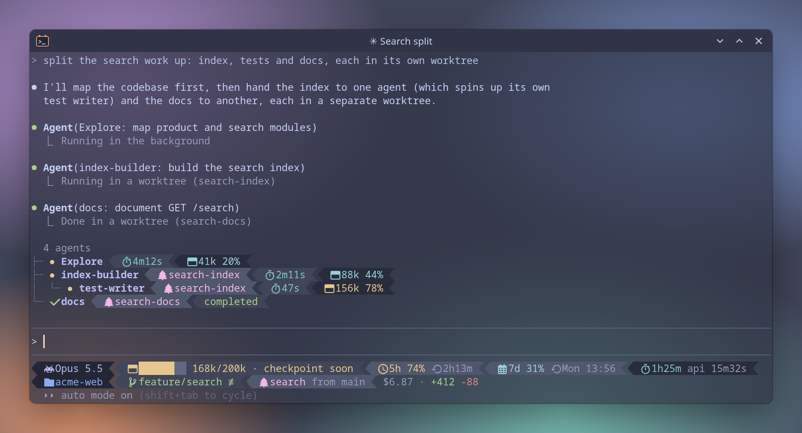

# Claude Code statusline

A two-line [Claude Code](https://code.claude.com/docs/en/statusline) statusline drawn by [Oh My Posh](https://ohmyposh.dev/), in the same Catppuccin Frappé diamond segments as the [shell prompt](../README.md#the-prompt). A small Python script styles the rows in the agent panel to match.


## What it shows

**Line 1, the session:**

| Segment | Shows |
| --- | --- |
| Model | Model name, e.g. `Opus 5.5` |
| Context | An 8-cell bar plus `NNNk/200k` tokens in context (see [thresholds](#context-thresholds)) |
| 5h | 5-hour usage limit: % used and time until it resets (`1h26m`) |
| 7d | 7-day usage limit: % used and when it resets (`Tue 18:00`) |
| Time | Wall-clock time of the session, with time spent waiting on the API dimmed after it |

The 5h and 7d segments turn yellow at 70% and red at 90%. They're hidden until Claude Code sends rate-limit data, which only happens after the first reply in a session.

**Line 2, where Claude is working:**

| Segment | Shows |
| --- | --- |
| Repo | Repo name only (falls back to the project folder's name outside a repo) |
| Git | Branch, ahead/behind, working tree and staged changes, stash count. Same symbols as the [prompt](../README.md#the-prompt) |
| Worktree | The worktree name and the branch it came from, when the session runs in a git worktree |
| Tail | Session cost (`$4.18`) and lines added/removed |

### Context thresholds

The bar always fills toward 200k tokens, whatever the model's real context window is. Past 200k a session gets slow and expensive, so that's where I checkpoint and start a fresh one.

| Tokens | Look |
| --- | --- |
| Under 150k | Green |
| 150k to 199k | Yellow, `checkpoint soon` |
| 200k and up | Whole segment red, `CHECKPOINT NOW` |



## Agent panel

`subagent-statusline.py` renders each row of the panel Claude Code shows while subagents run: the agent's name, its worktree (when it runs in one), how long it has been running, and its tokens and context %. Context turns yellow at 75%. Finished agents get a check mark and their final status. Claude Code draws the tree for nested agents itself, the script only fills in each row.



## Dependencies

| Need | Arch package | Notes |
| --- | --- | --- |
| Claude Code | - | a version with `statusLine` `refreshInterval` and `subagentStatusLine` |
| Oh My Posh 31.4+ | `oh-my-posh-bin` (AUR) | needs the `claude` segment, added in 31.4 |
| python3 | `python` | for the agent panel script, standard library only |
| git | `git` | for the git segment |
| A Nerd Font | `ttf-nerd-fonts-symbols-mono` | icons; WezTerm has them built in |

## Install

1. Install Oh My Posh: `paru -S oh-my-posh-bin` on Arch, or see [Oh My Posh](../README.md#oh-my-posh) for other systems.
2. Link the two files into `~/.claude/`. `install.sh` does this when it finds Claude Code (`~/.claude` exists), or by hand:

   ```bash
   ln -s ~/dotfiles/claude/claude-statusline.omp.json ~/.claude/
   ln -s ~/dotfiles/claude/subagent-statusline.py ~/.claude/
   ```

3. Add this to `~/.claude/settings.json`, next to whatever is already in it. `settings.json` holds other settings too, so it isn't linked from the repo.

   ```json
   "statusLine": {
     "type": "command",
     "command": "oh-my-posh claude --config ~/.claude/claude-statusline.omp.json",
     "refreshInterval": 5
   },
   "subagentStatusLine": {
     "type": "command",
     "command": "~/.claude/subagent-statusline.py"
   }
   ```

4. Start a new Claude Code session.

`refreshInterval` redraws the statusline every 5 seconds, so the clock and the agent rows keep moving while Claude works. Without it, the statusline only updates when the conversation changes.

## Customizing

- **Colors:** the `palette` block at the top of `claude-statusline.omp.json`, and `PALETTE` in `subagent-statusline.py`. Both use the Catppuccin Frappé names.
- **Context thresholds:** search the `.omp.json` for `150000` and `200000`. The bar's `200000` divisor and the `/200k` label are in the same template.
- **Rate-limit colors:** the `70` and `90` in the 5h and 7d segments' `foreground_templates` and `background_templates`.
- **Segments:** each segment is one entry in a block's `segments` list. Delete one to drop it.

To try a change without a live session, pipe a sample payload into Oh My Posh. The fields are listed in the [statusline docs](https://code.claude.com/docs/en/statusline).

```bash
echo '{"model":{"display_name":"Opus 5.5"},"workspace":{"project_dir":"'$PWD'"},"context_window":{"total_input_tokens":162000,"context_window_size":200000},"cost":{"total_cost_usd":4.18,"total_duration_ms":4325000,"total_api_duration_ms":545000}}' \
  | oh-my-posh claude --config ~/.claude/claude-statusline.omp.json
```

## Troubleshooting

- **No 5h / 7d segments:** normal until the first reply in a session. Claude Code only sends usage limits for Claude subscriptions, so they also stay hidden when you sign in with an API key.
- **Boxes instead of icons:** the terminal font has no Nerd Font icons. Install `ttf-nerd-fonts-symbols-mono` (kitty picks it up as a fallback) or use a Nerd Font.
- **Agent rows look like Claude Code's defaults:** when the script can't render a row it prints nothing for it, and Claude Code falls back to its own row. Set `CLAUDE_STATUSLINE_DEBUG=1` in the `env` block of `settings.json`, spawn an agent, then run the script on the saved input. Any agent missing from its output is one the script couldn't render:

  ```bash
  ~/.claude/subagent-statusline.py < ~/.cache/claude-statusline/subagent-input.json
  ```
