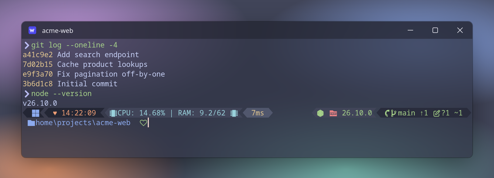

# WezTerm

A [WezTerm](https://wezterm.org/) config that copies my [kitty setup](../kitty/kitty.conf), so the terminal looks and behaves the same on Linux and Windows. One `wezterm.lua` works on both.




## What it matches

- **Colors:** Catppuccin Frappé with kitty's exact values (not WezTerm's built-in Catppuccin scheme, which differs slightly).
- **Font:** Noto Sans Mono 10pt, ligatures off. WezTerm ships the Nerd Font icons as a built-in fallback, so the prompt icons work without a patched font.
- **Cursor:** blinking beam in rosewater.
- **Window:** 75% opacity with background blur (KDE Plasma's blur on Linux, Acrylic on Windows), 2000 lines of scrollback, no close confirmation.
- **Tab bar:** powerline style at the bottom, hidden when only one tab is open. Tabs are titled like kitty's (`2 windows opened`) until renamed with `Alt+N`.
- **Shell:** your login shell on Linux, PowerShell 7 (`pwsh.exe`) on Windows.

## Shortcuts

The same as [kitty's](../README.md#kitty-shortcuts), and WezTerm's default shortcuts are turned off. A kitty "window" is a WezTerm pane.

| Keys | Action |
| --- | --- |
| `Ctrl+Shift+C` / `Ctrl+Shift+V` | Copy / paste |
| `Alt+Enter` / `Alt+W` | New / close pane |
| `Ctrl+Tab` / `Alt+Tab` | Next / previous pane |
| `Alt+R` | Resize mode |
| `Alt+L` | Zoom the current pane (toggle) |
| `Alt+T` / `Alt+Q` | New / close tab |
| `Alt+Right` / `Alt+Left` | Next / previous tab |
| `Alt+Up` / `Alt+Down` | Move tab forward / backward |
| `Alt+N` | Rename tab (empty resets it) |
| `Alt+Numpad+` / `Alt+Numpad-` / `Alt+Backspace` | Font bigger / smaller / reset |
| `Alt+F5` | Reload the config |

Selecting text copies it, and middle-click pastes the selection.

Where it differs from kitty:

- **`Alt+Enter`** splits the current pane along its longer side, which is roughly what kitty's tiling layouts do. New panes and tabs start in the home folder, like kitty's.
- **`Alt+L`**: WezTerm has no layouts to cycle, so this zooms the current pane to fill the tab and back (kitty's `stack` layout).
- **`Alt+R`** resize mode uses kitty's keys: `w` wider, `n` narrower, `t` taller, `s` shorter (hold `Ctrl` for bigger steps), or the arrow keys. `Esc` or `Enter` leaves it. The tab bar shows `RESIZE` while it's active.
- **`Alt+Tab`** is taken by the desktop on both KDE and Windows, so it never reaches the terminal (same as in kitty).

## Install (Linux)

1. Install WezTerm and the font. On Arch:

   ```bash
   sudo pacman -S wezterm noto-fonts
   ```

2. Link the config. Rerun `./install.sh` from the repo (it links `wezterm.lua` once `wezterm` is installed), or by hand:

   ```bash
   mkdir -p ~/.config/wezterm
   ln -s ~/dotfiles/wezterm/wezterm.lua ~/.config/wezterm/
   ```

The blur uses KDE Plasma's blur effect (Wayland or X11). On other desktops the window is still 75% transparent, just not blurred.

## Install (Windows 11)

1. Install WezTerm and PowerShell 7:

   ```powershell
   winget install wez.wezterm Microsoft.PowerShell
   ```

2. Install [Noto Sans Mono](https://fonts.google.com/noto/specimen/Noto+Sans+Mono): unzip it, select the `static\NotoSansMono-*.ttf` files, then right-click and choose **Install**.
3. Copy the config into place (run from the cloned repo):

   ```powershell
   New-Item -ItemType Directory -Force "$HOME\.config\wezterm" | Out-Null
   Copy-Item wezterm\wezterm.lua "$HOME\.config\wezterm\"
   ```

4. For the prompt, set up [Oh My Posh in PowerShell](../README.md#windows-powershell).

If you have an older `%USERPROFILE%\.wezterm.lua`, delete it: WezTerm reads that file first.

## Usage notes

- WezTerm reloads the config on its own when the file changes. `Alt+F5` forces a reload.
- Font size changes with `Alt+Numpad+` / `Alt+Numpad-` go in steps of 2pt like kitty's, not WezTerm's usual 10%.

## Customizing

- **Colors:** the `c` table near the top and `config.colors` (the 16 ANSI colors are in `ansi` and `brights`).
- **Font:** `config.font` and `config.font_size`.
- **Opacity and blur:** `config.window_background_opacity`, `config.kde_window_background_blur` (Linux) and `config.win32_system_backdrop` (Windows).
- **Shortcuts:** `config.keys`, plus `config.key_tables.resize_pane` for resize mode.
